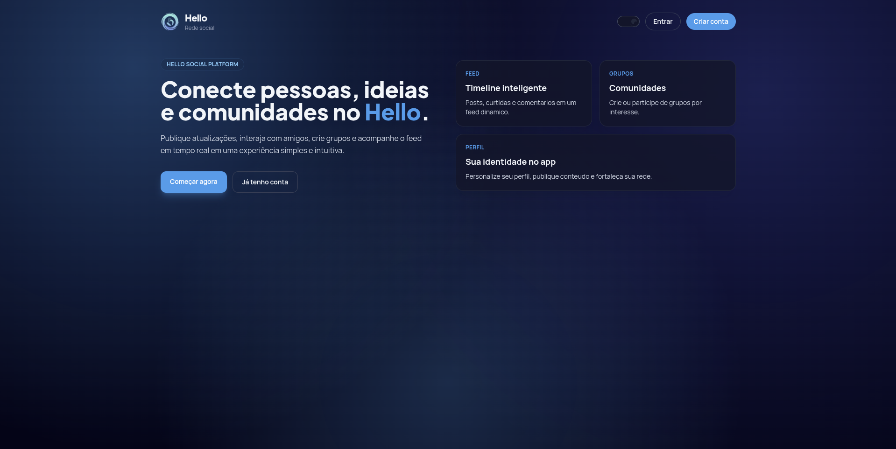
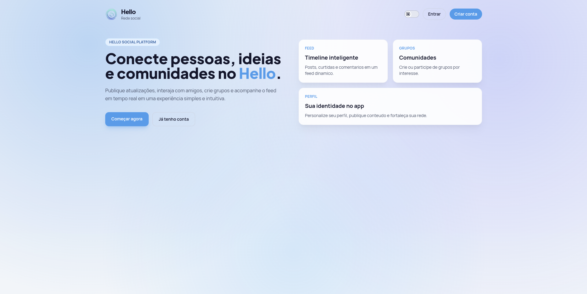
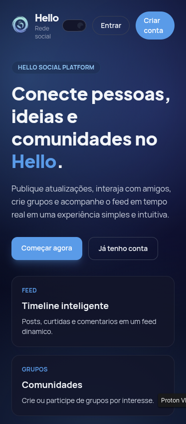
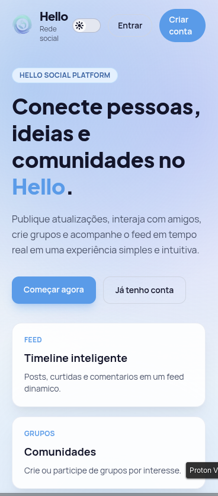
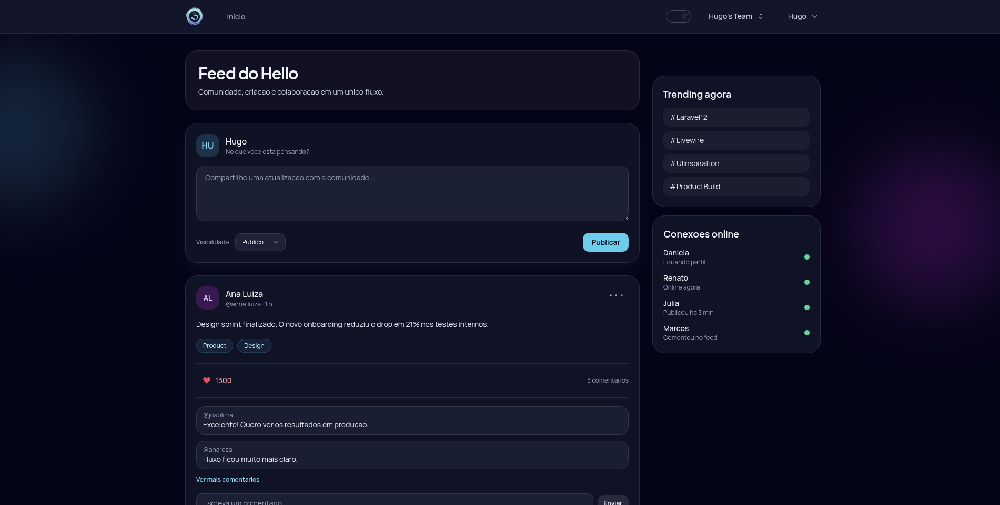
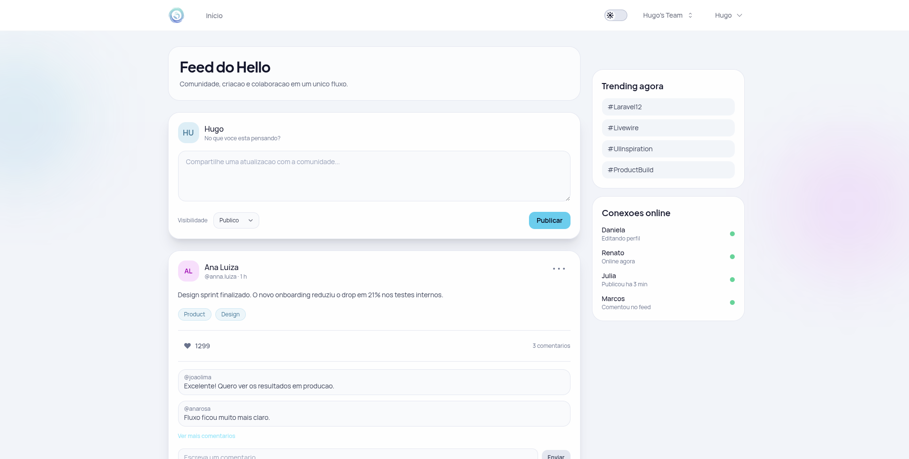
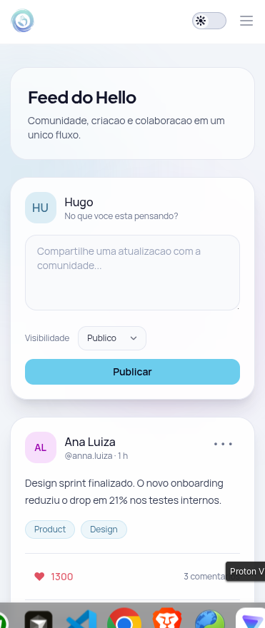
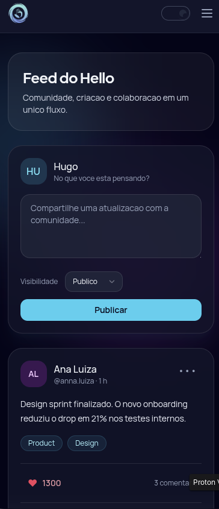
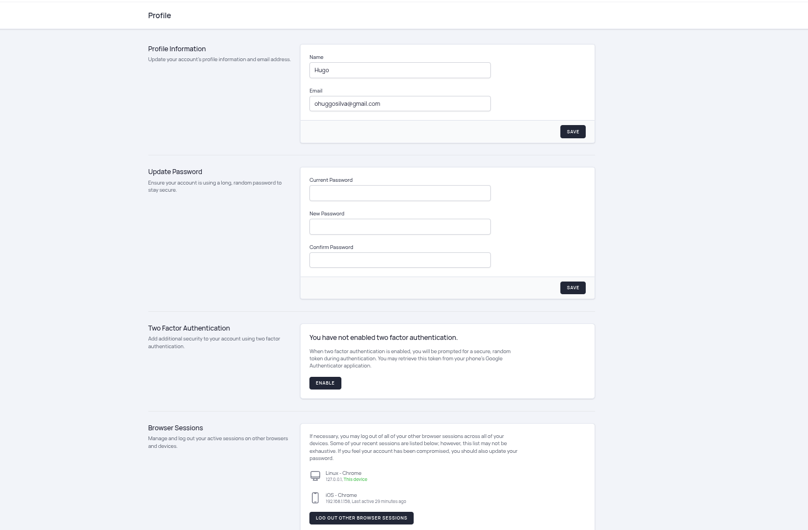

# Hello | Rede Social com Laravel 12, Livewire e Jetstream

Projeto de rede social em desenvolvimento com foco em arquitetura Laravel moderna, autenticação robusta e feed interativo.

## ✨ Stack principal

- PHP 8.2+
- Laravel 12
- Livewire 3
- Laravel Jetstream (stack Livewire)
- Laravel Fortify
- Laravel Sanctum

## ✅ O que já foi implementado

### 🧠 ORM e relacionamentos Eloquent

Relacionamentos já praticados no projeto:

- `One to One`: `User -> Profile`
- `One to Many`: `User -> Post`
- `Many to Many`: `User <-> Group`
- `Has One Through`: `User -> PrivacySetting` (via `Profile`)
- `Has Many Through`: `Country -> Post` (via `User`)
- `One to One Polymorphic`: `User/Group -> Image`
- `One to Many Polymorphic`: `Post/Photo -> Comment`
- `Many to Many Polymorphic`: `Post/Video <-> Tag`

Núcleo social conectado a modelos reais com:

- `Post` com `comments`, `likes`, `tags` e `user`
- `Comment` polimórfico (`commentable`)
- `Like` vinculado a `Post` e `User`

### 🔐 Auth completo com Jetstream + Fortify

Recursos de autenticação e segurança já ativos:

- Registro de usuário
- Login e recuperação de senha
- Atualização de senha e perfil
- 2FA (Two-Factor Authentication) com confirmação
- Rate limiting de login e 2FA
- Exclusão de conta

### 👥 Teams com Jetstream

Implementações já disponíveis:

- Criação automática de time pessoal no cadastro
- Criação e edição de equipes
- Convite e gestão de membros
- Remoção de membros e exclusão de equipe
- Papéis/permissões de equipe (`admin`, `editor`)

### ⚖️ Authorization com Policies

Policies implementadas:

- `PostPolicy` registrada via `Gate::policy` e usada com `authorize()` no `PostController`
- `TeamPolicy` para controle de acesso a equipes (visualização, update, membros e remoção)

### 📰 Feed interativo e dinâmico

O feed já não é apenas estático:

- Criação de post com persistência no banco
- Carregamento de posts reais com `with`, `withCount`, ordenação e limite
- Interação de curtidas e comentários na estrutura do feed
- Atualização de lista via evento Livewire (`post-created`)

### 📧 E-mail de boas-vindas

- Template HTML de boas-vindas implementado em `resources/views/emails/welcome.blade.php`
- Mailable `WelcomeEmail` criado
- Listener `SendWelcomeNotification` preparado para evento de registro (`Registered`)

## 🖼️ Telas do projeto

### 1) Início (desktop/mobile)

### 2) Feed (desktop/mobile)

### 3) Template de e-mail (evento de cadastro)

### 4) Profile com Auth

## 📌 Objetivo do projeto

Construir uma rede social real para portfólio, explorando boas práticas de Laravel com foco em:

- segurança 
- arquitetura
- autenticação moderna